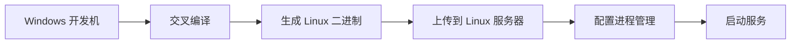

# 生产环境部署
在 Windows 环境下为**非 Windows 系统**（如 Linux 服务器）部署 Beego 应用时，必须使用 **交叉编译（Cross-Compilation）**。以下是详细步骤和注意事项：

---

### **1. 为什么需要交叉编译？**
- Windows 默认编译生成 `.exe` 文件（PE 格式），而 Linux 生产环境需要 **ELF 格式**的可执行文件。
- 编译环境和运行环境的 **CPU 架构/操作系统** 不一致（如开发机是 `windows/amd64`，服务器是 `linux/amd64`）。

---

### **2. 交叉编译命令（关键步骤）**
在 **Windows 终端**（如 PowerShell 或 CMD）中执行：

```bash
# 编译为 Linux 可执行文件（最常见场景）
set GOOS=linux
set GOARCH=amd64   # 适用于大多数云服务器
go build -ldflags "-s -w" -o myapp-linux

# 其他常见目标平台：
# 1. 编译为 macOS 可执行文件
set GOOS=darwin
set GOARCH=amd64
go build -o myapp-macos

# 2. 编译为 Windows 可执行文件（非交叉编译）
set GOOS=windows
set GOARCH=amd64
go build -o myapp.exe
```

---

### **3. 解决 CGO 依赖问题**
如果项目依赖 **CGO**（如使用了 SQLite、Redis C 库等）：
```bash
# 禁用 CGO（推荐，避免跨平台库依赖）
set CGO_ENABLED=0
go build -ldflags "-s -w" -o myapp-linux

# 必须启用 CGO 时（需配置 Linux 交叉编译链）：
# 1. 安装 Mingw-w64 或 Cygwin
# 2. 指定 CC 编译器（复杂且易出错，生产环境尽量避免）
set CGO_ENABLED=1
set CC=x86_64-linux-gnu-gcc  # 需提前安装
go build -o myapp-linux
```

> **强烈建议**：生产环境禁用 CGO（`CGO_ENABLED=0`），利用纯 Go 实现的库（如 `go-sqlite3` 可替换为 `modernc.org/sqlite`）。

---

### **4. 配置文件路径处理（Windows ⇨ Linux）**
在代码中**避免硬编码路径**，使用相对路径或环境变量：
```go
// 正确：通过启动参数或环境变量指定配置
beego.LoadAppConfig("ini", "conf/prod.conf")

// 启动时指定配置文件（生产环境推荐）
./myapp -config=/opt/app/prod.conf
```

---

### **5. 验证交叉编译结果**
1. 将生成的 `myapp-linux` 上传到 Linux 服务器
2. 添加可执行权限：
   ```bash
   chmod +x myapp-linux
   ```
3. 运行测试：
   ```bash
   ./myapp-linux -config=prod.conf
   ```

---

### **6. 完整部署流程（Windows ⇨ Linux）**


---

### **常见问题及解决方案**
| 问题现象                | 原因                  | 解决方案                          |
|-------------------------|-----------------------|-----------------------------------|
| `exec format error`     | 二进制格式不匹配      | 检查 `GOOS`/`GOARCH` 是否匹配目标系统 |
| `file not found`        | Linux 路径错误        | 使用绝对路径或检查文件权限        |
| 依赖 C 库失败           | 未禁用 CGO            | 编译时设置 `CGO_ENABLED=0`        |
| 中文乱码                | Windows/Linux 编码差异| 统一使用 UTF-8 编码               |

---

### **生产环境最佳实践**
1. **编译命令标准化**：
   ```bash
   # 生产环境推荐命令
   set GOOS=linux
   set GOARCH=amd64
   set CGO_ENABLED=0
   go build -ldflags "-s -w" -o myapp
   ```
   
2. **使用 Docker 构建**（免交叉编译）：
   ```Dockerfile
   # Dockerfile 示例
   FROM golang:1.20 AS builder
   WORKDIR /app
   COPY . .
   RUN CGO_ENABLED=0 GOOS=linux go build -o /myapp

   FROM alpine:latest
   COPY --from=builder /myapp /myapp
   ENTRYPOINT ["/myapp"]
   ```

3. **通过 CI/CD 自动化**（如 GitHub Actions）：
   ```yaml
   jobs:
     build:
       runs-on: windows-latest
       steps:
         - name: Build for Linux
           run: |
             $env:GOOS = "linux"
             $env:GOARCH = "amd64"
             $env:CGO_ENABLED = "0"
             go build -o myapp
   ```

---

### **总结**
- ✅ **必须交叉编译**：从 Windows 部署到 Linux 时，使用 `GOOS=linux GOARCH=amd64`。
- ✅ **禁用 CGO**：避免依赖本地库，设置 `CGO_ENABLED=0`。
- ✅ **路径规范化**：配置文件/资源路径使用 Linux 风格（`/opt/app` 而非 `C:\app`）。
- ✅ **自动化构建**：用 Docker 或 CI/CD 工具规避平台差异问题。

按照上述流程，即使开发环境是 Windows，也能稳定部署 Beego 应用到 Linux 生产服务器。